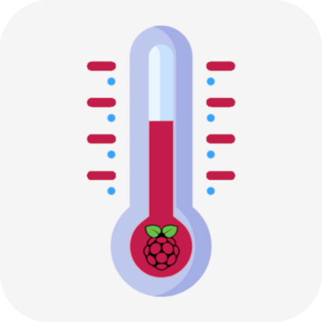
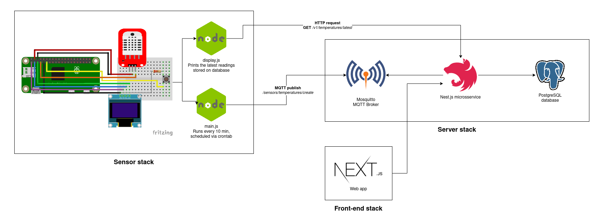
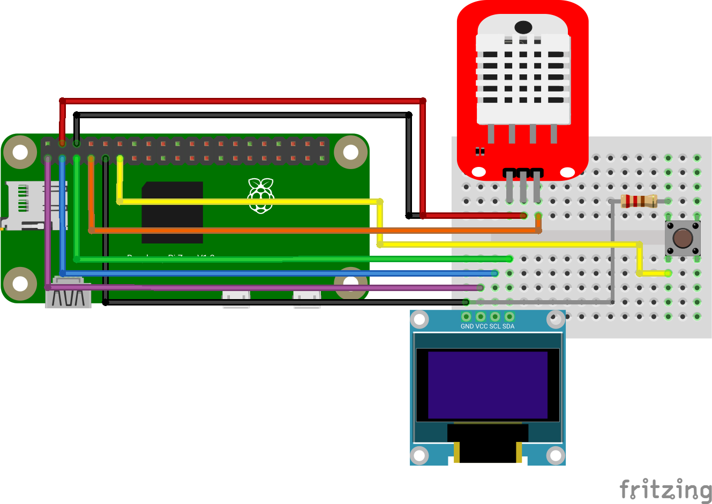

<!-- markdownlint-disable MD033 MD041 -->

  
  <h1 align="center">RPi Smart Thermometer</h1>
  

    
  

## Architecture

Every 30 minutes, a Node.js script reads the current temperature and humidity from the DHT22 sensor plugged to a Raspberry Pi Zero W via GPIO and then publishes this data via MQTT to the Mosquitto server.

On the server stack, a Nest.js microsservice listens to a specific topic on the Mosquitto server and, when there's a new message, it gets parsed, validated and stored on a PostgreSQL database. This stack is deployed with Docker Compose to my local Raspberry Pi 4 home server.

There's also a button that, when pressed, will fetch the latest reading from the Nest.js API and show it on the OLED display. After 20s, the display will turn off to avoid burn-in.

## Schematics

## Tech

### Hardware

- Raspberry Pi Zero W
- DHT22 sensor
- OLED display
- Push button
- 1K resistor

### Software

- Node.js 16
- Typescript
- Nest.js
- Next.js
- Docker
- PostgreSQL
- Mosquitto
